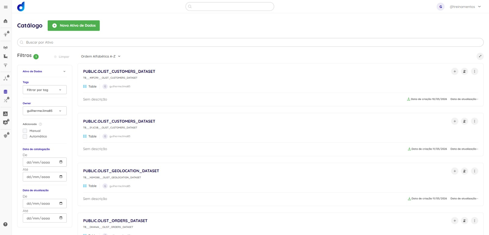
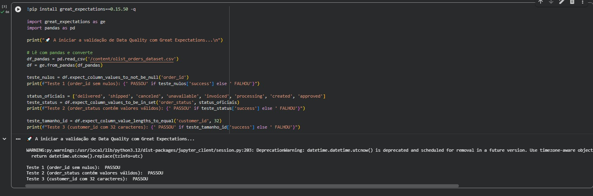
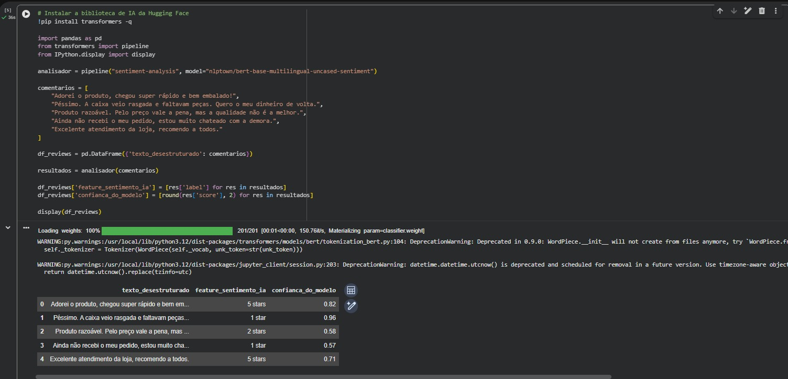
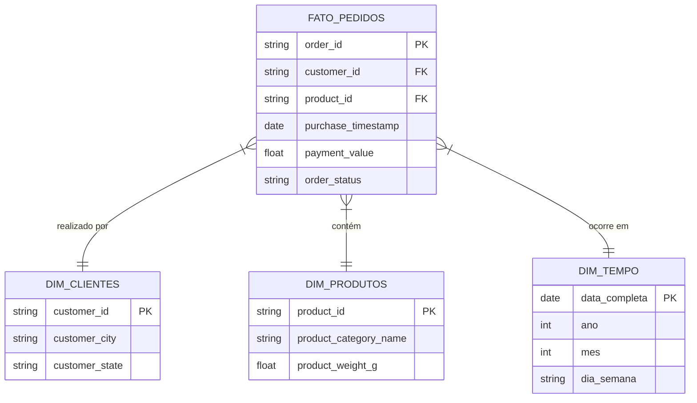
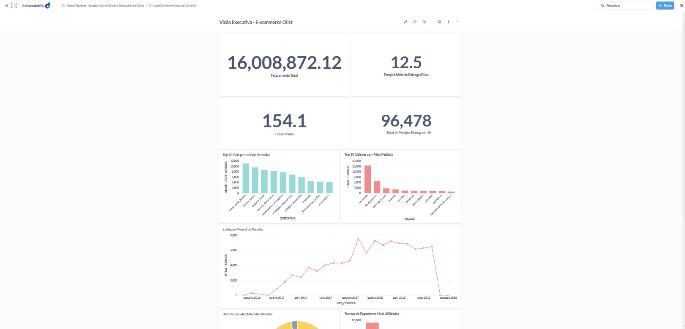
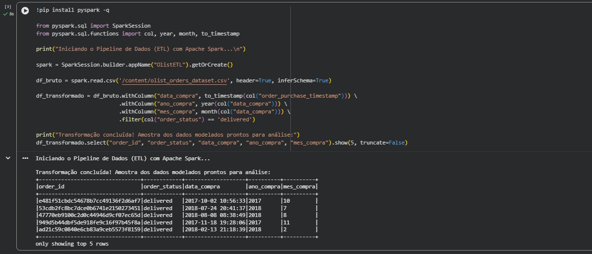
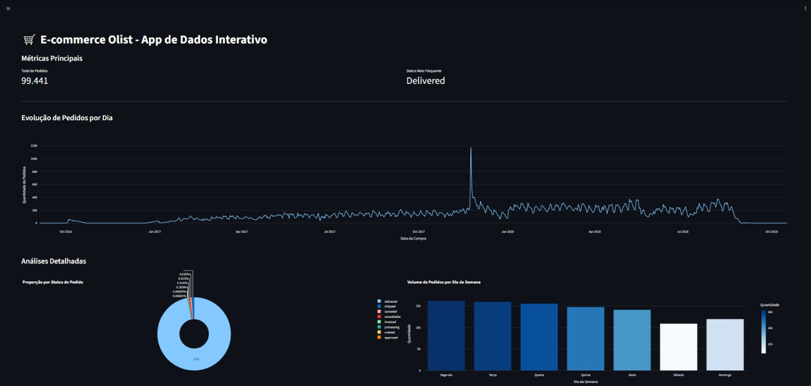

# 🛒 Projeto Olist - Análise de E-commerce e Data App

**Autor:** José Guilherme Lima de Carvalho
**Mês/Ano:** 03/2026

## 📌 Sobre o Projeto
Este projeto foi desenvolvido como parte de um case técnico para demonstrar habilidades ponta a ponta em Engenharia de Dados, Análise de Dados (BI) e desenvolvimento de Aplicativos de Dados. 

## 🛠️ Tecnologias Utilizadas
* **Dadosfera:** Ingestão de dados e catalogação.
* **Snowflake:** Armazenamento em nuvem e consultas SQL.
* **Metabase:** Criação de consultas nativas e visualização de dados.
* **Python (Pandas, Great Expectations, Transformers):** Processamento, qualidade de dados e IA.
* **Streamlit:** Desenvolvimento e deploy do aplicativo web interativo.

---

## 📋 Item 0: Planejamento e Agilidade
Para garantir a entrega contínua de valor e o alinhamento com os objetivos de negócio, o projeto foi estruturado utilizando metodologias ágeis (Kanban). Abaixo está o fluxo de trabalho seguido:

| 📝 Backlog / To Do | ⚙️ In Progress | ✅ Done (Concluído) |
| :--- | :--- | :--- |
| [Item Bônus] Gerador de imagens de produtos com IA | [Item 10] Gravação do Pitch de Apresentação | [Item 1] Seleção da Base de Dados (Olist) |
| | | [Item 2 e 3] Ingestão e Catalogação na Dadosfera |
| | | [Item 4] Testes de Data Quality |
| | | [Item 5] Feature Engineering com LLM |
| | | [Item 6] Diagrama de Modelagem (Star Schema) |
| | | [Item 7] Dashboard Executivo (Metabase) |
| | | [Item 9] Deploy do Data App (Streamlit) |

---

## 🎯 Item 1: Seleção da Base de Dados
Utilizamos a base de dados pública do e-commerce brasileiro **Olist**, que possui mais de 100.000 pedidos anonimizados, abrangendo informações de clientes, pagamentos, geolocalização, produtos e avaliações.

---

## ☁️ Item 2 e 3: Ingestão e Catálogo de Dados
Os dados brutos em `.csv` foram importados para a plataforma Dadosfera, onde as tabelas físicas foram geradas no Snowflake e devidamente catalogadas para governança.

* **Link para o Catálogo na Dadosfera:** [Acessar Catálogo](https://app.dadosfera.ai/pt-BR/catalog/data-assets?tags=&asset_types=&owner=guilherme.lima85&page=1&sort=az)

**Evidência do Catálogo:**

---

## 🛡️ Item 4: Data Quality (Qualidade de Dados)
Para garantir a confiabilidade das análises, foi implementada uma etapa de validação de dados utilizando a biblioteca **Great Expectations**. Foram criadas regras (expectations) para verificar a integridade da chave primária (`order_id` sem nulos), a consistência dos domínios (`order_status` válidos) e a padronização das chaves estrangeiras (`customer_id` com 32 caracteres).

**Evidência dos Testes de Qualidade:**

---

## 🤖 Item 5: Inteligência Artificial e LLMs
Para extrair valor de dados desestruturados, foi aplicada uma técnica de *Feature Engineering* baseada em Modelos de Linguagem Natural (LLMs). Utilizamos a biblioteca `transformers` da Hugging Face para analisar os comentários de texto deixados pelos clientes (tabela de Reviews) e gerar novas variáveis estruturadas de Sentimento (classificação em estrelas e score de confiança). Estas novas *features* podem ser integradas no Data Warehouse para análises avançadas.

**Evidência da Transformação com IA:**

---

## 📐 Item 6: Modelagem de Dados
Para a construção do Data Warehouse no Snowflake (via Dadosfera), foi adotada a **Modelagem Dimensional de Ralph Kimball (Star Schema)**. 

**Justificativa:** A escolha deste modelo deve-se à sua alta performance para consultas analíticas (OLAP) e à facilidade de compreensão por parte dos usuários de negócio. Centralizar as métricas transacionais em uma tabela de Fatos e rodear com tabelas de Dimensões permite agregações rápidas e filtros intuitivos na ferramenta de BI.

**Diagrama da Arquitetura (Star Schema):**

## 📊 Item 7: Análise Exploratória e Dashboard Executivo

A partir das tabelas físicas, foram construídas consultas SQL complexas (com agregações e JOINs) para responder a perguntas de negócio e montar um painel gerencial completo.

**Métricas desenvolvidas (Overdelivery):**
1. Faturamento Total (R$)
2. Ticket Médio por Pedido
3. Tempo Médio de Entrega (Dias)
4. Nota Média de Satisfação dos Clientes
5. Evolução Mensal de Pedidos (Série Temporal)
6. Top 10 Categorias Mais Vendidas
7. Top 10 Cidades Compradoras

* **Link para o Dashboard na Dadosfera:** [https://metabase-treinamentos.dadosfera.ai/dashboard/287-visao-executiva-e-commerce-olist]

**Evidência do Dashboard:**

---

## ⚙️ Item 8: Pipeline de Dados (ETL) com Apache Spark

Como requisito de processamento e preparação dos dados (ETL) para as camadas de consumo, foi desenvolvido um pipeline utilizando **PySpark** (Apache Spark). 

Atendendo ao **requisito bônus** do case, o Spark foi utilizado para extrair os dados brutos, realizar a tipagem correta das colunas de data (timestamp), derivar novas *features* temporais (ano e mês) para facilitar as agregações no painel de BI, e aplicar filtros de limpeza (mantendo apenas pedidos com status `delivered`).

**Evidência do Pipeline PySpark:**

---

## 💻 Item 9: Aplicativo de Dados Interativo (Data App)

Foi desenvolvido um aplicativo interativo utilizando Python e Streamlit para permitir que os usuários finais explorem os dados de forma dinâmica, com filtros iterativos e análises detalhadas como proporção de status e dias da semana com maior volume de compras.

**Evidência do Aplicativo:**

### Como rodar o aplicativo localmente:
1. Clone este repositório.
2. Certifique-se de ter o Python instalado.
3. Instale as dependências: `pip install streamlit pandas plotly`
4. Execute o comando no terminal: `streamlit run app.py`

---
*Projeto construído com foco em resolução de problemas, governança de dados e entrega de valor para o negócio.*
